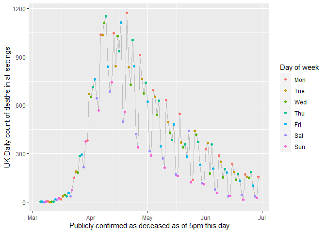
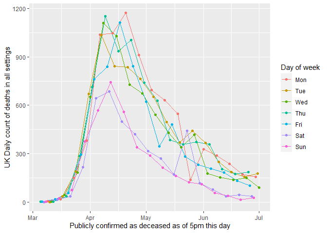
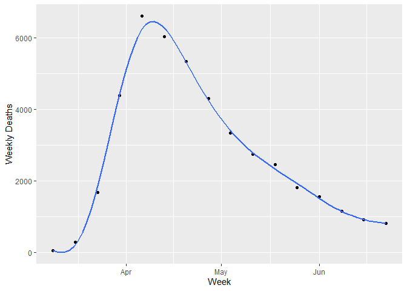
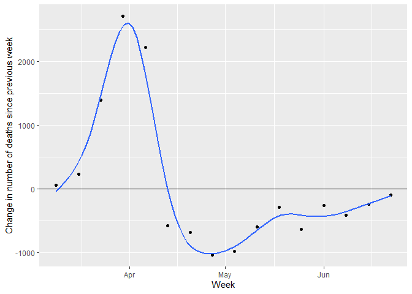
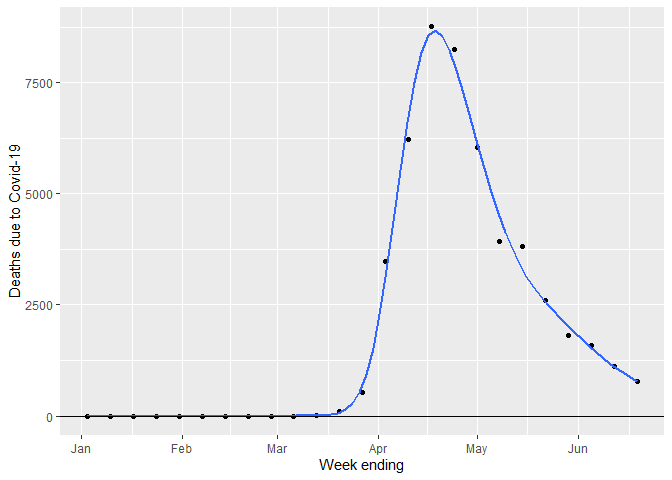

Using ggplot2 to visualise Covid-19 deaths the UK
================
Andi (<almost@gmail.com>,
@[inductivestep](https://twitter.com/InductiveStep))
01 July 2020

This script shows how to use ggplot2, with the help of some tidyverse
tools, to plot UK Covid-19 deaths data.

## General setup

``` r
library(tidyverse)
library(lubridate)
```

(I thought `lubridate` was loaded as part of `tidyverse` - apparently
not.)

## Use DHSC and PHE data

### Get the data

The latest data is available from Department of Health and Social Care
and Public Health England [over
here](https://www.gov.uk/guidance/coronavirus-covid-19-information-for-the-public).

``` r
death <- read_csv("https://assets.publishing.service.gov.uk/government/uploads/system/uploads/attachment_data/file/896264/COVID-19_UK_deaths_time_series_29_June.csv")
names(death)
```

    ## [1] "Publicly confirmed as deceased as of 5pm this day"
    ## [2] "Date published by DHSC"                           
    ## [3] "UK Cumulative count of deaths in all settings"    
    ## [4] "UK Daily count of deaths in all settings"

Those variables names are *very long* but I’ll just keep them as-is and
use backquotes.

In RStudio, this views the data:

``` r
View(death)
```

### Fix the dates

Parse the “%d-%b-%y” format (e.g., “28-Jun-20”) as a `Date` object.

``` r
death2 <- death %>%
  mutate_at(vars(`Publicly confirmed as deceased as of 5pm this day`),
            ~readr::parse_date(., "%d-%b-%y"))
```

Also add variables for the day of week (Monday, Tuesday, …) and the date
of the Monday on the start of each week.

``` r
death2 <- death2 %>%
  mutate(`Day of week` = wday(`Publicly confirmed as deceased as of 5pm this day`,
                              label = T,
                              week_start = 1),
         Week = floor_date(`Publicly confirmed as deceased as of 5pm this day`,
                            unit = "weeks",
                            week_start = 1))
```

``` r
death2 %>%
  select(`Publicly confirmed as deceased as of 5pm this day`,
         `Day of week`,
         Week) %>%
  head(10)
```

    ## # A tibble: 10 x 3
    ##    `Publicly confirmed as deceased as of 5pm this day` `Day of week` Week      
    ##    <date>                                              <ord>         <date>    
    ##  1 2020-03-05                                          Thu           2020-03-02
    ##  2 2020-03-06                                          Fri           2020-03-02
    ##  3 2020-03-07                                          Sat           2020-03-02
    ##  4 2020-03-08                                          Sun           2020-03-02
    ##  5 2020-03-09                                          Mon           2020-03-09
    ##  6 2020-03-10                                          Tue           2020-03-09
    ##  7 2020-03-11                                          Wed           2020-03-09
    ##  8 2020-03-12                                          Thu           2020-03-09
    ##  9 2020-03-13                                          Fri           2020-03-09
    ## 10 2020-03-14                                          Sat           2020-03-09

### Plot

First, plot number of deaths reported every day, colouring points by day
of week.

``` r
death2 %>%
  ggplot(aes(x = `Publicly confirmed as deceased as of 5pm this day`,
             y = `UK Daily count of deaths in all settings`)) + 
  scale_colour_hue() + # Day of week is ordered; this uses a qual palette
  geom_line(color = "grey") +
  geom_point(aes(color=`Day of week`))
```

<!-- -->

We can also add separate lines for each day of the week like this:

``` r
death2 %>%
  ggplot(aes(x = `Publicly confirmed as deceased as of 5pm this day`,
             y = `UK Daily count of deaths in all settings`,
             color = `Day of week`)) + 
  geom_line() +
  geom_point() +
  scale_colour_hue() 
```

<!-- -->

Deaths are reported when paperwork is filed, rather than time of death,
which apparently explains the dips on Saturday and Sunday.

### Aggregrate by week

One way to “smooth” the day-to-day variation in data is to sum by week:

``` r
death_week <- death2 %>%
  group_by(Week) %>%
  summarise(`Weekly Deaths` = sum(`UK Daily count of deaths in all settings`),
            Days = n())
```

Now plot, with a generalized additive model (GAM) smoother, selecting
only weeks where there were data for all seven days.

These week(s) are excluded:

``` r
death_week %>%
  filter(Days != 7) %>%
  select(Week, `Weekly Deaths`, Days)
```

    ## # A tibble: 2 x 3
    ##   Week       `Weekly Deaths`  Days
    ##   <date>               <dbl> <int>
    ## 1 2020-03-02               3     4
    ## 2 2020-06-29             331     2

``` r
death_week %>%
  filter(Days == 7) %>%
  ggplot(aes(x = Week, y = `Weekly Deaths`)) +
  geom_point() +
  geom_smooth(method = "gam", formula = y ~ s(x, bs = "tp"), se = F) 
```

<!-- -->

### Change by week

Plot change in the number of deaths compared to the previous week. First
do the arithmetic:

``` r
death_week$Last_Week_Deaths <- lag(death_week$`Weekly Deaths`,1)
death_week$Change           <- with(death_week,
                                    `Weekly Deaths` - Last_Week_Deaths)
```

Plot:

``` r
death_week %>%
  filter(Days == 7) %>%
  ggplot(aes(x = Week, y = Change)) +
  geom_point() +
  geom_hline(yintercept=0) +
  geom_smooth(method = "gam", formula = y ~ s(x, bs = "cs"), se = F) +
  ylab("Change in number of deaths since previous week")
```

<!-- -->

## ONS data

The ONS data are [over
here](https://www.ons.gov.uk/peoplepopulationandcommunity/birthsdeathsandmarriages/deaths/bulletins/deathsregisteredweeklyinenglandandwalesprovisional/previousReleases).

### Setup

``` r
library(readxl)
```

The `read_csv` command (used above) can read data from the web. This is
not currently (30 June 2020) the case for `read_xlsx`; the command below
gives the error that the path “does not exist”.

``` r
ons_dat <- read_xlsx("https://www.ons.gov.uk/visualisations/dvc875a/fig1/datadownload.xlsx")
```

The solution is to download the file first then read from there. The
“mode” option is needed to download the file correctly (xlsx files are
zip files, so they must be downloaded as binary).

``` r
localExcelTemp <- tempfile(fileext = ".xlsx")
download.file("https://www.ons.gov.uk/visualisations/dvc875a/fig1/datadownload.xlsx",
              destfile = localExcelTemp,
              mode = "wb")
```

This read the file, skipping over the preamble and remove the footer.

``` r
ons_dat <- read_xlsx(localExcelTemp, skip = 6) %>%
  slice(1:(n()-2))
names(ons_dat)
```

    ## [1] "Week no."                                         
    ## [2] "All deaths - 2020"                                
    ## [3] "All deaths - 5-year average"                      
    ## [4] "Minimum deaths over 5 years"                      
    ## [5] "Maximum deaths over 5 years"                      
    ## [6] "Influenza and pneumonia mentions - 2020"          
    ## [7] "Influenza and pneumonia mentions - 5-year average"
    ## [8] "COVID-19"

``` r
View(ons_dat)
```

### Fix the dates

These data give the number of deaths by week for England and Wales for
weeks ending 3 Jan 2020 to 19 June 2020.

The first column gives week numbers. Let’s generate some proper dates:

``` r
startDate <- as.Date("2020-01-03")
numDates  <- nrow(ons_dat)
ons_dat$`Week ending` <- startDate + (0:(numDates-1)) * 7
```

### Plot\!

``` r
ons_dat %>%
  ggplot(aes(x = `Week ending`, y = `COVID-19`)) +
  geom_point() +
  ylab("Deaths due to Covid-19") +
  geom_smooth(method = "gam", formula = y ~ s(x, bs = "ds"), se = F)  
```

<!-- -->
