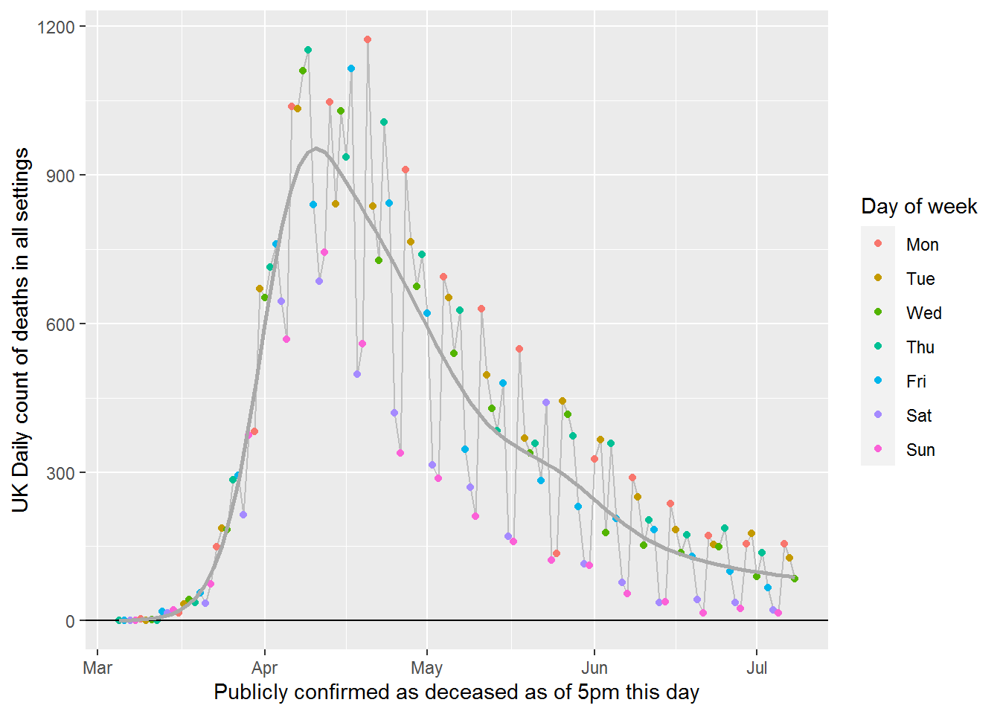

Using ggplot2 to visualise Covid-19 deaths the UK
================

This R code shows how to use ggplot2, with the help of some other
tidyverse tools, to plot UK Covid-19 deaths data.

See it rendered [as a webpage here](https://inductivestep.github.io/ggplot-and-covid/).

