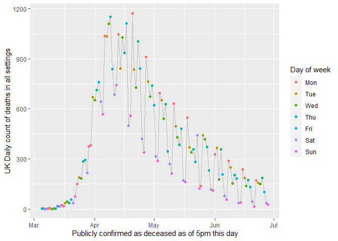
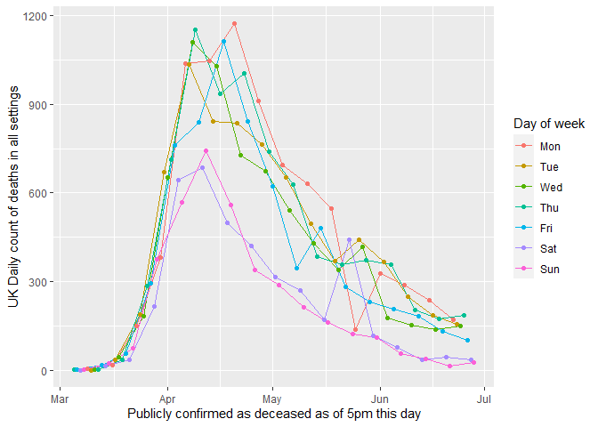
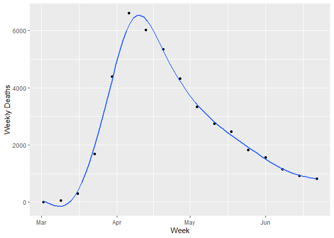
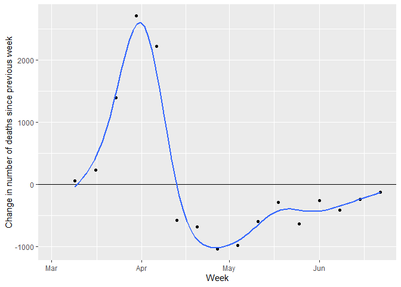

Using ggplot2 to visualise Covid-19 deaths the UK
================
Andi (<almost@gmail.com>,
@[inductivestep](https://twitter.com/InductiveStep))
28 June 2020

### Load packages

``` r
library(tidyverse)
library(lubridate)
```

(I thought `lubridate` was part of `tidyverse` - apparently not.)

### Get the data

The latest data is available from Department of Health and Social Care
and Public Health England [over
here](https://www.gov.uk/guidance/coronavirus-covid-19-information-for-the-public).

``` r
death <- read_csv("https://assets.publishing.service.gov.uk/government/uploads/system/uploads/attachment_data/file/896042/2020-06-28-COVID-19-UK-deaths-time-series.csv")
names(death)
```

    ## [1] "Publicly confirmed as deceased as of 5pm this day"
    ## [2] "Date published by DHSC"                           
    ## [3] "UK Cumulative count of deaths in all settings"    
    ## [4] "UK Daily count of deaths in all settings"

Those variables names are *very long* but I’ll just keep them as-is and
use backquotes.

In RStudio, this views the data:

``` r
View(death)
```

### Fix the dates

Parse the “%d-%b-%y” format (e.g., “28-Jun-20”) as a POSIXct date.

``` r
death2 <- death %>%
  mutate_at(vars(`Publicly confirmed as deceased as of 5pm this day`),
            function(x) readr::parse_date(x, "%d-%b-%y"))
```

Also add variables for the day of week (Monday, Tuesday, …) and the date
of the Monday on the start of each week.

``` r
death2 <- death2 %>%
  mutate(`Day of week` = wday(`Publicly confirmed as deceased as of 5pm this day`,
                              label = T,
                              week_start = 1),
         Week = floor_date(`Publicly confirmed as deceased as of 5pm this day`,
                            unit = "weeks",
                            week_start = 1))
```

``` r
death2 %>%
  select(`Publicly confirmed as deceased as of 5pm this day`,
         `Day of week`,
         Week) %>%
  head(10)
```

    ## # A tibble: 10 x 3
    ##    `Publicly confirmed as deceased as of 5pm this day` `Day of week` Week      
    ##    <date>                                              <ord>         <date>    
    ##  1 2020-03-05                                          Thu           2020-03-02
    ##  2 2020-03-06                                          Fri           2020-03-02
    ##  3 2020-03-07                                          Sat           2020-03-02
    ##  4 2020-03-08                                          Sun           2020-03-02
    ##  5 2020-03-09                                          Mon           2020-03-09
    ##  6 2020-03-10                                          Tue           2020-03-09
    ##  7 2020-03-11                                          Wed           2020-03-09
    ##  8 2020-03-12                                          Thu           2020-03-09
    ##  9 2020-03-13                                          Fri           2020-03-09
    ## 10 2020-03-14                                          Sat           2020-03-09

### Plot

First, plot number of deaths reported every day, colouring points by day
of week.

``` r
ggplot(death2, aes(x = `Publicly confirmed as deceased as of 5pm this day`,
                   y = `UK Daily count of deaths in all settings`)) + 
  scale_colour_hue() + # Day of week is ordered; this uses a qual palette
  geom_line(color = "grey") +
  geom_point(aes(color=`Day of week`))
```

<!-- -->

We can also add separate lines for each day of the week like this:

``` r
ggplot(death2, aes(x = `Publicly confirmed as deceased as of 5pm this day`,
                   y = `UK Daily count of deaths in all settings`,
                   color = `Day of week`)) + 
  geom_line() +
  geom_point() +
  scale_colour_hue() 
```

<!-- --> Deaths are
reported when paperwork is filed, rather than time of death, which
apparently explains the dips on Saturday and Sunday.

### Aggregrate by week

One way to “smooth” the data is sum by week:

``` r
death_week <- death2 %>%
  group_by(Week) %>%
  summarise(`Weekly Deaths` = sum(`UK Daily count of deaths in all settings`),
            Days = n())
```

``` r
p <- ggplot(death_week, aes(x = Week, y = `Weekly Deaths`)) +
         geom_point() +
         geom_smooth(method = "gam", se = F) 
p
```

    ## `geom_smooth()` using formula 'y ~ s(x, bs = "cs")'

<!-- -->

### Change by week

Plot change in the number of deaths compared to the previous week.

``` r
death_week$Last_Week_Deaths <- lag(death_week$`Weekly Deaths`,1)
death_week$Change           <- with(death_week, `Weekly Deaths` - Last_Week_Deaths)
```

``` r
p <- ggplot(death_week, aes(x = Week, y = Change)) +
         geom_point() +
         geom_hline(yintercept=0) +
         geom_smooth(method = "gam", se = F) +
         ylab("Change in number of deaths since previous week")
p
```

<!-- -->
